# Greenpill Knowledge Map

This map combines:

- confirmed public signals from the current Greenpill footprint
- themes already visible in your workshop material

Use it as a conversation artifact, not as a final org chart.

```mermaid
flowchart LR
  GP["Greenpill Network"]

  GP --> ID["Identity"]
  GP --> ORG["How it organizes"]
  GP --> BUILD["What it builds"]
  GP --> MEDIA["How it tells the story"]
  GP --> PLACE["Where it shows up"]
  GP --> THEMES["Topic clusters"]
  GP --> AUD["Who it serves"]
  GP --> OUT["What outcomes it aims for"]

  subgraph Identity
    ID --> ID1["Regenerative network"]
    ID --> ID2["Bridge between web3 and impact communities"]
    ID --> ID3["Media + community + tooling"]
  end

  subgraph Organization
    ORG --> O1["Stewards"]
    ORG --> O2["Chapters"]
    ORG --> O3["Guilds"]
    ORG --> O4["Pods"]
    ORG --> O5["Network support roles"]
    ORG --> O6["Community calls"]
    ORG --> O7["Greenpill Garden"]
  end

  subgraph Build
    BUILD --> B1["Dev Guild"]
    B1 --> B2["Green Goods"]
    B1 --> B3["GreenWill"]
    B1 --> B4["Impact Reef"]
    B1 --> B5["Cookie Jar"]
    B1 --> B6["Gardens"]
    B1 --> B7["Allo / capital allocation experiments"]
    B1 --> B8["Impact reporting + reputation"]
  end

  subgraph Media
    MEDIA --> M1["Podcast"]
    MEDIA --> M2["Paragraph publication"]
    MEDIA --> M3["Writers Guild"]
    MEDIA --> M4["Books"]
    MEDIA --> M5["Workshops / Builder Spaces"]
    MEDIA --> M6["IRL + video storytelling"]
  end

  subgraph Place
    PLACE --> P1["Brasil"]
    PLACE --> P2["Ottawa / Toronto / Great Lakes"]
    PLACE --> P3["NYC"]
    PLACE --> P4["Nigeria / CIV / Kenya / Africa corridor"]
    PLACE --> P5["Phangan / India / East Asia"]
    PLACE --> P6["Germany / Cape Town / other nodes"]
  end

  subgraph Topic_Clusters
    THEMES --> T1["Education"]
    THEMES --> T2["Environment"]
    THEMES --> T3["DeSci"]
    THEMES --> T4["DePin"]
    THEMES --> T5["Funding mechanisms"]
    THEMES --> T6["Public goods coordination"]
  end

  subgraph Audience
    AUD --> A1["Curious newcomers"]
    AUD --> A2["Local organizers"]
    AUD --> A3["Builders"]
    AUD --> A4["Writers / educators / researchers"]
    AUD --> A5["Partners and funders"]
    AUD --> A6["Existing community members"]
  end

  subgraph Outcomes
    OUT --> U1["Local regenerative initiatives"]
    OUT --> U2["Onchain impact reporting"]
    OUT --> U3["Community-owned funding flows"]
    OUT --> U4["Cross-pollination across chapters"]
    OUT --> U5["Accessible onboarding into Ethereum"]
    OUT --> U6["Shared knowledge commons"]
  end

  O2 --> P1
  O2 --> P2
  O2 --> P3
  O2 --> P4
  O2 --> P5
  O2 --> P6

  O3 --> B1
  O3 --> M3
  O4 --> T1
  O4 --> T2
  O4 --> T3
  O4 --> T4
  O4 --> T5

  M1 --> A1
  M3 --> A4
  B1 --> A3
  O2 --> A2
  O7 --> U1
  O7 --> U2
  O7 --> U3
  B1 --> U2
  B1 --> U3
  MEDIA --> U6
```

## Simplest reading of the map

Greenpill seems to sit at the intersection of five systems:

1. Local community organizing through chapters.
2. Skill and topic coordination through guilds and pods.
3. Product and protocol experimentation through the Dev Guild.
4. Narrative and education through podcast, publishing, and writers.
5. Network coordination through stewards, calls, and programs like Greenpill Garden.

## Most important website implication

The site should show relationships between these systems.

Right now the public website mostly shows content and entry links.

The stronger future version should show:

- how chapters connect to guilds
- how builders support stewards
- how media supports onboarding
- how topic pods create cross-pollination
- how all of that turns into local impact

## Open questions to resolve with stewards

- Which parts of this map are core identity versus temporary experiments?
- Which products are mature enough to feature as flagship tools?
- Which topic clusters should stay internal, and which deserve public landing pages?
- Is Greenpill Garden a one-off program, a repeating flagship, or the new backbone of the network?
- How much of the Regen Coordination story should live on the main Greenpill site?
